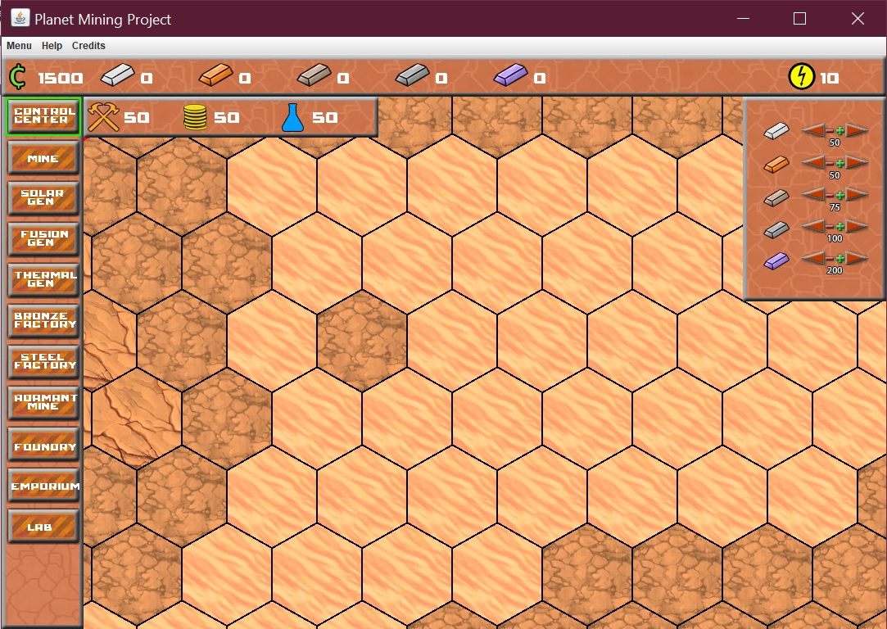
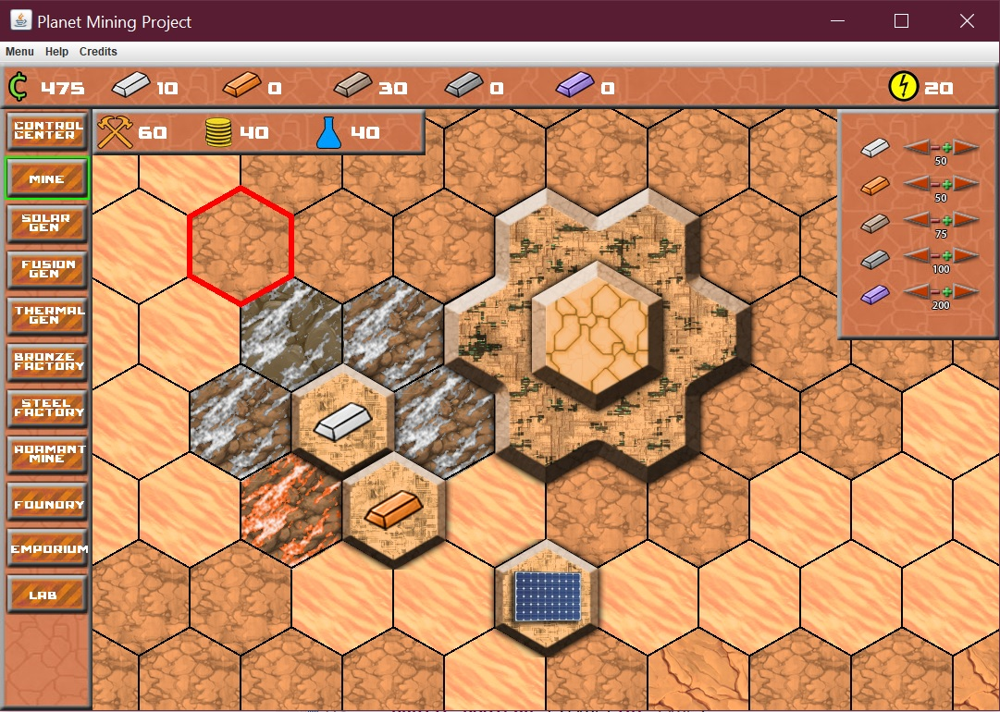
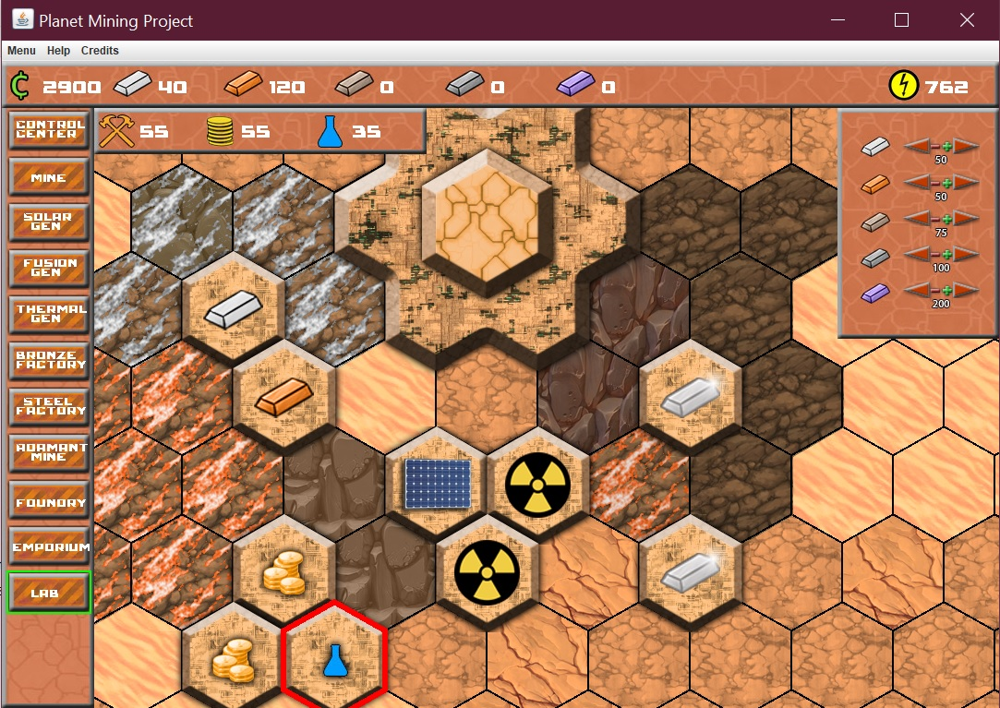

# Planet Mining Game
Resource management Java game where you construct buildings, collect resources by digging to progressively deeper levels and gather influence to achieve victory!
<h2>Installation</h2>
If you want to try it out:
<ol>
<li>Download the PlanetMiningGame1.1.zip and extract it</li>
<li>Run PlanetMiningGame.jar in cmd using: java -jar PlanetMiningGame.jar</li>
</ol>
<h2>How to Play</h2>

Start off by building a command center somewhere (Select it from the menu and press Q to build it).

Press D to dig a tile which can reveal various resources. Note: the deeper you dig the more energy it will use!

You can also trade your money for resources, this is important early on so that you can build mines on resources (which will generate that resource per turn)

Once you are out of energy and dont want to build anything new or trade for more resources, press Enter to end the turn.

The goal of the game is to achieve 100 of all 3 influences types (which you can get by constructing buildings associated with each type).

<h2>Noise</h2>
To randomly generate the terrain the game uses the perlin noise generator from the com.heresysoft.arsenal.utils package.
<h2>Screenshots</h2>

    
    
    

